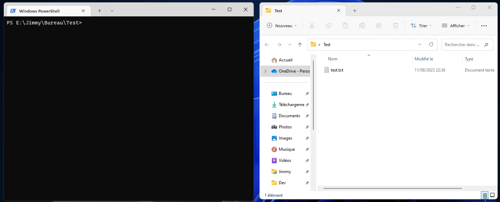

# Txt list to JSON

This tool allows you to get a JSON list from a simple .txt file.

## How to install

You need to install NPM module :
- globally : `npm i -g txtlist2json`
- or locally in dev dependancy : `npm i -D txtlist2json`

## How to use

Put your list in a *.txt* file, one item by line, and launch `txtlist2json` command with .txt file in argument.

You get the JSON list in *list.json* new file in the folder where you ran the command.

